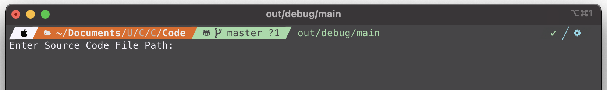

[![MIT License][license-shield]][license-url]

<!-- PROJECT LOGO -->
<br />
<p align="center">
  <a href="https://github.com/github_username/repo_name">
    
  </a>

  <h3 align="center">Simple Go-- Compiler</h3>

  <p align="center">
  A simple compiler for Go-- fictional language
  </p>
</p>


<!-- TABLE OF CONTENTS -->
<details open="open">
  <summary><h2 style="display: inline-block">Table of Contents</h2></summary>
  <ol>
    <li>
      <a href="#about-the-project">About The Project</a>
      <ul>
        <li><a href="#built-with">Built With</a></li>
      </ul>
    </li>
    <li>
      <a href="#getting-started">Getting Started</a>
      <ul>
        <li><a href="#prerequisites">Prerequisites</a></li>
        <li><a href="#installation">Installation</a></li>
      </ul>
    </li>
    <li><a href="#usage">Usage</a></li>
    <ul>
        <li><a href="#how-to-run">How to Run</a></li>
        <li><a href="#example-images">Example Images</a></li>
      </ul>
    <li><a href="#license">License</a></li>
  </ol>
</details>


<!-- ABOUT THE PROJECT -->
## About The Project

This is a very simple Hybird Compiler, which means it translates the code into machine code and runs in a VM. I wrote this as part of my assignments at University for the Compiler Construction course. 
The language it compiles is a made up language called Go--. Rules for this language are as follows:

<ol>
  <li><b>Basic Data Types</b>: integer, char.</li>
  <li><b>Keywords</b>:</li>
    <ol>
      <li><b>Decision statements</b>: if elif else.</li>
      <li>Looping statement: while.</li>
      <li>Read data statement: in.</li>
      <li>Function declaration statement: func.</li>
      <li>Write data statements: print (print and remain on same line), println (print and move to next line).</li>
      <li>Return keyword: ret.</li>
    </ol>
  <li>Arithmetic Operators: + - * /.</li>
  <li>Relational operators: < <= > >= = /=.</li>
  <li>Comments: /* enclose comment in */.</li>
  <li>Identifier: A letter followed by any number of letters or digits.</li>
  <li>Numeric constants: Only integers.</li>
  <li>Variable declaration Operator: :.</li>
  <li>Literal constants: A letter enclosed in single quotes.</li>
  <li>Strings: Only used in print statements(no variables for them).</li>
  <li>Parenthesis, Braces, Square Brackets.</li>
  <li>Aassignment operator: :=.</li>
  <li>Input operator: >>.</li>
  <li>semi colon, colon, comma.</li>
</ol>

### Built With

* [C++](https://en.wikipedia.org/wiki/C%2B%2B)


<!-- GETTING STARTED -->
## Getting Started

To get a local copy up and running follow these simple steps.

### Prerequisites

* C++ - Google for your OS.
* [git](https://git-scm.com)

### Installation

1. Clone the repo
   ```sh
   git clone https://github.com/saeenyoda/Gomm_Compiler.git
   ```


<!-- USAGE EXAMPLES -->
## Usage

### How to Run
1. Open up command line or terminal and navigate to the cloned repo's directory
   ```sh
   cd "PATH-TO-DIRECTORY"
   ```
2. Run the main.cpp file (Using terminal on mac)
   ```sh
   clang++ -std=c++14 -stdlib=libc++ -I "PATH-TO-includes-FOLDER" "PATH-TO-main.cpp" "PATH-TO-lexical_analyzer.cpp" "PATH-TO-parser.cpp" "PATH-TO-translator.cpp" -o out/release/main 
   ```

***NOTE:***  
   &nbsp;&nbsp;&nbsp;&nbsp;&nbsp;&nbsp;`The instructions given above are for mac and that too using the terminal. For other OS and IDEs refer to the relevant docs.`

This will present you with the following Screen:


Now enter the file path for the source code here. It will then run the compiler and output following files inside data folder:

<ol>
  <li><b>words.txt:</b> Generated by the Lexical Analyzer, contains tokens.</li>
  <li><b>parsetree.txt:</b> Generated by the Parser, contains parsed tree of the code.</li>
  <li><b>parse-symboltable.txt:</b> Generated by the Parser, contains Symbol Table with Identifier and Datatype rows.</li>
  <li><b>tac.txt:</b> Generated by the Translator, contains the three address code.</li>
  <li><b>translator-symboltable.txt:</b> Generated by the Translator, contains updated Symbol Table, now with memory addresses.</li>
</ol>
 

<!-- LICENSE -->
## License

Distributed under the MIT License. See `LICENSE` for more information.


<!-- MARKDOWN LINKS & IMAGES -->
<!-- https://www.markdownguide.org/basic-syntax/#reference-style-links -->
[license-shield]: https://img.shields.io/github/license/saeenyoda/Inverted_Indexing?label=license&style=for-the-badge
[license-url]: https://github.com/saeenyoda/Inverted_Indexing/blob/master/LICENSE
